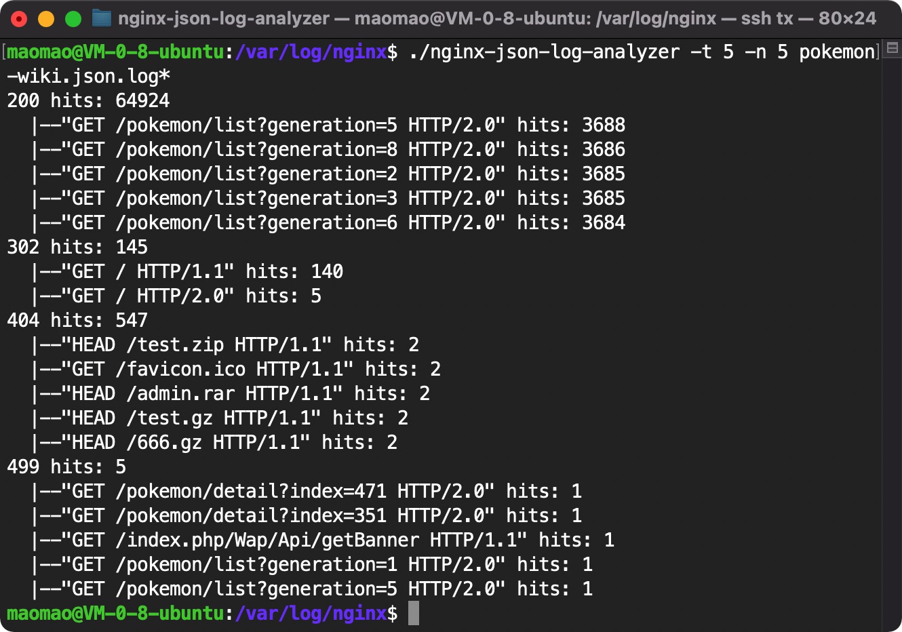

# Nginx-Log-Analyzer

[](https://github.com/fantasticmao/nginx-log-analyzer/actions)
[](https://codecov.io/gh/fantasticmao/nginx-log-analyzer)

[](https://goreportcard.com/report/github.com/fantasticmao/nginx-log-analyzer)
[](https://github.com/fantasticmao/nginx-log-analyzer/releases)
[](https://github.com/fantasticmao/nginx-log-analyzer/blob/main/LICENSE)

README [English](README.md) | [中文](README_ZH.md)

## What is it

Nginx-Log-Analyzer is a lightweight (simplistic) log analyzer, used to analyze Nginx access logs for myself.

Nginx-Log-Analyzer is written in Go programming language, needs only a 2 MB executable file to run, currently supported
features are as follows:

- [x] Filter logs based on the request time
- [x] Support multiple log format configurations
    - combined (Nginx default configuration)
    - JSON
- [x] Analyze multiple files at the same time
- [x] Analyze .gz compressed files
- [x] Support a variety of [statistical indicators](#specify-the-analysis-type--t)

### Advantages compared to [GoAccess](https://goaccess.io/)

GoAccess is an excellent and powerful real-time web log analyzer, interactive viewer that runs in a terminal in \*nix
systems or through your browser. But as far as I know, GoAccess seems does not support counting URI response time by
percentile, Nginx-Log-Analyzer supports this feature.

If I knew about GoAccess before developing Nginx-Log-Analyzer, I might choose to use it directly. GoAccess is so
powerful, I love GoAccess.

### Advantages compared to [ELK](https://www.elastic.co/cn/what-is/elk-stack)

Although ELK is powerful, it is troublesome to install and configure, and it also has certain requirements for machine
performance. Nginx-Log-Analyzer is more lightweight and easier to use, suitable for some simple log analysis scenarios.

## Quick start

### Installation

Just download the binary executable file for the corresponding platform from the
GitHub [Release](https://github.com/fantasticmao/nginx-log-analyzer/releases) page of Nginx-Log-Analyzer.

#### GeoIP2 and GeoLite2

[GeoIP2](https://www.maxmind.com/en/geoip2-city) is a commercial IP geolocation database, need to pay to use
it. [GeoLite2](https://dev.maxmind.com/geoip/geolite2-free-geolocation-data) is a free and low-precision version of
GeoIP2, distribute by [Attribution-ShareAlike 4.0 International](https://creativecommons.org/licenses/by-sa/4.0/deed.en)
license, download by logging in to the [MaxMind](https://www.maxmind.com/en/accounts/current/geoip/downloads) official
website.

When using Nginx-Log-Analyzer, if you need to resolve the geographic location of the IP (that is, use the `-t 4`
mode), then you will need to download the GeoIP2 or GeoLite2 City database file, save it to the `City.mmdb` file in the
default configuration directory `${HOME}/.config/nginx-log-analyzer/`. The corresponding shell commands are as follows:

```shell
~$ mkdir -p ${HOME}/.config/nginx-log-analyzer
~$ tar -xzf GeoLite2-City_20211109.tar.gz
~$ cp GeoLite2-City_20211109/GeoLite2-City.mmdb ${HOME}/.config/nginx-log-analyzer/City.mmdb
```

#### Configure Nginx

Nginx-Log-Analyzer parses Nginx access logs in combined format by default, which means that the logs will contain the
following fields:

- $remote_addr
- $remote_user
- $time_local
- $request
- $status
- $body_bytes_sent
- $http_referer
- $http_user_agent

When using Nginx-Log-Analyzer, if you need more types of [statistical indicators](#specify-the-analysis-type--t), then
you will need to use the `-lf json` option to specify the log parsing mode to the JSON format, and need to add the
following `log_format` and `access_log` directives in the Nginx configuration:

```text
log_format json_log escape=json '{"remote_addr":"$remote_addr",'
                                '"time_local":"$time_local",'
                                '"request":"$request",'
                                '"status":$status,'
                                '"body_bytes_sent":$body_bytes_sent,'
                                '"http_user_agent":"$http_user_agent",'
                                '"request_time":$request_time}';
access_log /path/to/access.json.log json_log;
```

- The `log_format` directive can only appear in the `http` context;
- The `access_log` directive could appear in the `http`, `server`, `location` context, and should use the `log_format`
  declared above;
- You can make multiple `access_log`s at the same time without deleting the original configuration. e.g.
    ```text
    access_log /path/to/access.log;
    access_log /path/to/access.json.log json_log;
    ```

Related document: http://nginx.org/en/docs/http/ngx_http_log_module.html

### Command line options

#### show version -v

The `-v` options show Nginx-Log-Analyzer's build version, build time, and Git Commit at build time.

#### specify the configuration directory -d

The `-d` option specify the configuration directory that Nginx-Log-Analyzer required at runtime, the default value
is `${HOME}/.config/nginx-log-analyzer/`.

#### specify the log format -lf

The `-lf` option specify the log format parsed by Nginx-Log-Analyzer, available values are combined and json, the
default value is combined.

#### specify the analysis type -t

The `-t` option specify the type of this analysis, the analysis type and corresponding statistical indicators are as
follows:

| Supported | Analysis Type `-t` | Statistical Indicators                                                           | Required Fields or Libraries                                                                                                                                     |
| --------- | ------------------ | -------------------------------------------------------------------------------- | ---------------------------------------------------------------------------------------------------------------------------------------------------------------- |
| ✅        | 0                  | PV and UV                                                                        | $remote_addr                                                                                                                                                     |
| ✅        | 1                  | Most visited IPs                                                                 | $remote_addr                                                                                                                                                     |
| ✅        | 2                  | Most visited URIs                                                                | $request                                                                                                                                                         |
| ✅        | 3                  | Most visited User-Agents                                                         | $http_user_agent                                                                                                                                                 |
| ✅        | 4                  | Most visited user countries and cities                                           | $remote_addr, MaxMind [GeoIP2](https://www.maxmind.com/en/geoip2-city) or [GeoLite2](https://dev.maxmind.com/geoip/geolite2-free-geolocation-data) City Database |
| ✅        | 5                  | Most frequent response status                                                    | $status, $request                                                                                                                                                |
| ✅        | 6                  | Largest average response time URIs                                               | $request, $request_time                                                                                                                                          |
| ✅        | 7                  | Largest percentile response time URIs, e.g. p1(min), p50(median), p95, p100(max) | $request, $request_time                                                                                                                                          |

#### limit the analysis start and end time -ta -tb

`-ta` and `-tb` options are used to filter logs based on the request time, `ta` is the abbreviation of time after, `tb`
is the abbreviation of time before.

`-ta` and `-tb` options required the $time_local field in `log_format` directive of Nginx configuration.

#### limit the output lines number -n -n2

`-n` and `-n2` options are used to limit the number of output lines of Nginx-Log-Analyzer, `-n2` option only works
in `-t 4` mode.

#### specify the percentile value -p

The `-p` option specify the percentile value in the `-t 7` mode, the default value is 95.

### Usages

#### Filter logs based on the request time


#### Analyze multiple files at the same time


#### Analyze .gz compressed files


#### Count the most visited IPs


#### Count the most visited URIs


#### Count the most visited User-Agents


#### Count the most visited countries and cities


#### Count the most frequently response status



#### count the largest URI average response times


#### count the largest URI percentile response times


## FQA

Q: Will it support real-time analysis in the future?

A: No. If you want this feature, it is recommended to use solutions such as GoAccess, ELK, Grafana + Time Series DBMS.

## License

GeoLite2 Database [License](https://dev.maxmind.com/geoip/geolite2-free-geolocation-data#license)

Nginx-Log-Analyzer [License](https://github.com/fantasticmao/nginx-log-analyzer/blob/main/LICENSE)

Copyright (c) 2021 fantasticmao
